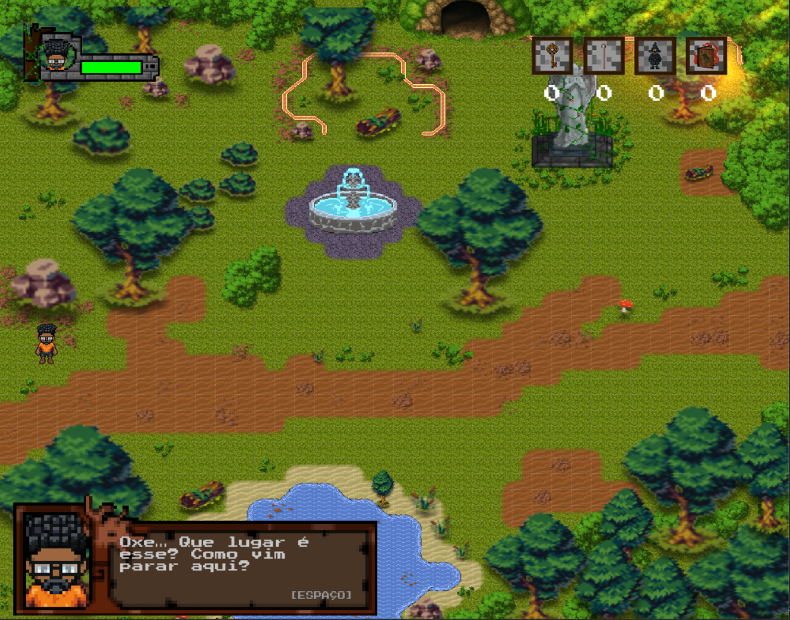
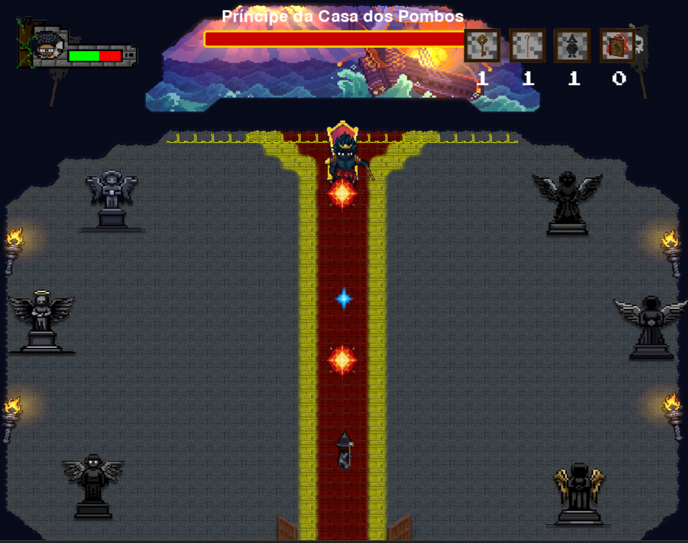
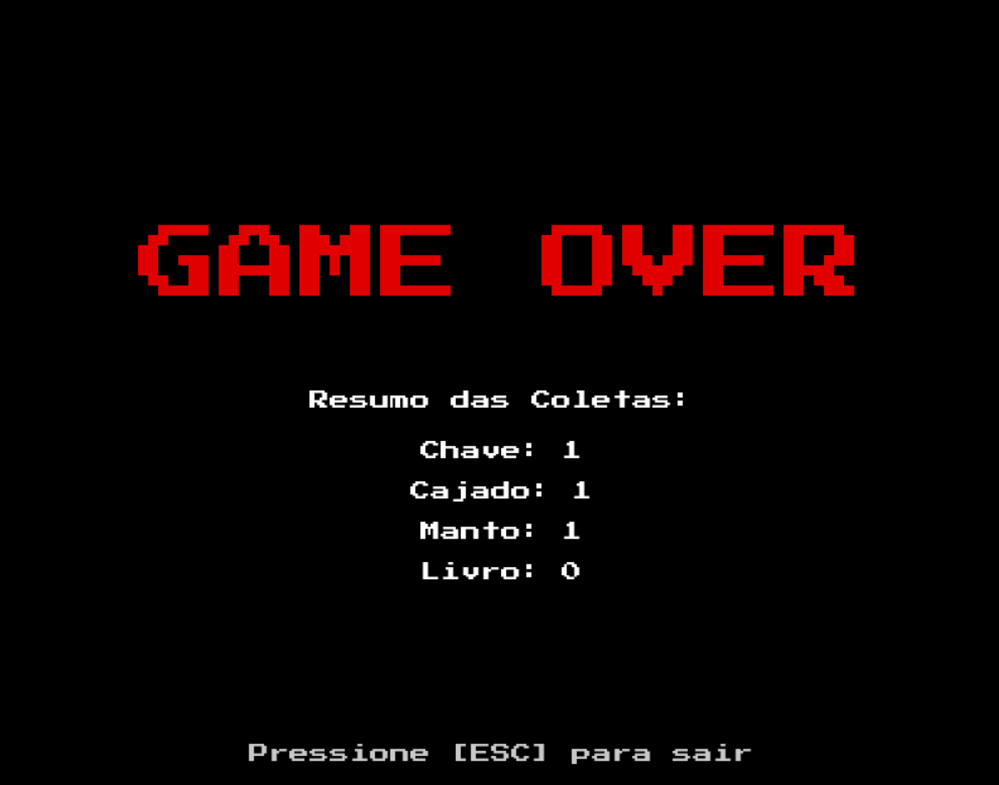

# Projeto_ip_torre_
# "A Ordem dos Discretos"
Bem-vindo ao A Ordem dos Discretos, um jogo 2D em Python com Pygame onde você explora mapas, coleta artefatos mágicos e desbloqueia novos poderes!

## Sobre o Jogo
Você é um aprendiz em busca dos lendários itens da Ordem dos Discretos: o Manto da Sabedoria e o Cajado da Vacuidade. Para encontrá-los, será necessário explorar diferentes mapas, interagir com objetos misteriosos e superar desafios de navegação e lógica.

### Funcionalidades
- Três mapas interconectados: primeiro mapa, segundo mapa e a torre
- Sistema de mensagens na tela com animações
- Coletáveis interativos (baús e caveiras)
- Mudança dinâmica de visual do personagem ao coletar itens
- Detecção de colisões e transições de cenário

### Controles
- Setas direcionais: mover o personagem
- Fechar (X): sair do jogo

 ### Requisitos
- Python 3.x
- [Pygame](https://www.pygame.org/): `pip install pygame`

### Como jogar
1. Clone o repositório ou baixe os arquivos do projeto.
2. Certifique-se de que as imagens e arquivos `.py` estão na estrutura correta:

   
## Imagens do Jogo

  
  
  
  
  
  

## Ferramentas, Bibliotecas e Frameworks Utilizados
### Bibliotecas
- **Pygame**  
  - **Uso**: Biblioteca principal para criar a janela do jogo, gerenciar eventos, desenhar elementos na tela e atualizar os frames. 
  - **Justificativa**: Pygame é ideal para jogos 2D em Python, sendo leve, eficiente e fácil de aprender, adequada para um projeto educacional.

- **pygame.mixer**  
  - **Uso**: Gerenciamento de música de fundo e efeitos sonoros, como "Hobbit OST 8 bits.mp3" e "OST BOSS FIGHT.mp3".  
  - **Justificativa**: Módulo integrado ao Pygame, simplifica a adição de áudio, aumentando a imersão do jogador.

- **random**  
  - **Uso**: Geração de comportamentos aleatórios para o boss, como padrões de ataque.  
  - **Justificativa**: Biblioteca padrão do Python, útil para adicionar variabilidade e dinamismo ao jogo.

- **os**  
  - **Uso**: Manipulação de caminhos de arquivos para carregar recursos (imagens, áudio) de forma portátil.  
  - **Justificativa**: Garante compatibilidade entre diferentes sistemas operacionais ao acessar arquivos do jogo.

### Ferramentas
- **Piskel**  
  - **Uso**: Criação e edição de sprites em pixel art, como os do personagem, boss e coletáveis.  
  - **Justificativa**: Ferramenta gratuita e intuitiva para pixel art, com suporte a camadas e exportação para PNG, facilitando a integração com o Pygame.

- **Liberated Pixel Cup**  
  - **Uso**: Fonte de assets gráficos, como mapas e sprites adicionais.  
  - **Justificativa**: Coleção gratuita de alta qualidade, licenciada para uso livre, economizando tempo na criação de gráficos e garantindo consistência visual.

- **Microsoft Teams**  
  - **Uso**: Comunicação e colaboração entre a equipe durante o desenvolvimento.  
  - **Justificativa**: Plataforma robusta para reuniões, compartilhamento de arquivos e organização, essencial para coordenar o trabalho em equipe, especialmente de forma remota.

#
## Estruturação do Código 
### Modularização:
Divisão em arquivos com funções específicas:
- **config.py**: Configurações (ex.: Largura, FPS).
- **assets.py**: Carrega recursos (ex.: mapas, sprites).
- **player.py**: Lógica do jogador.
- **Boss.py**: Lógica do boss.
- **game.py**: Loop principal.

### Orientação a Objetos:
Uso de classes para representar elementos do jogo:
- **Game:** Controla o fluxo (início, mapas, transições)
- **Player**: Controla movimento e coleta.
- **Boss:** Gerencia ataques e diálogos.
- **WindGust:** Projéteis do boss.

#

## Conceitos utilizados aprendidos na disciplina 
Durante o desenvolvimento, aplicamos diversos conceitos aprendidos na disciplina, entre eles:

**Loops**: O loop principal do jogo, em game.py (game_loop), usa um while self.running para atualizar a tela, processar eventos e mover o jogador a cada frame, garantindo jogabilidade contínua. Outro exemplo está no método update da classe Boss em Boss.py, onde um loop implícito (via contador self.anim_counter) anima os ataques do boss.

**Funções**: Funções foram amplamente usadas para modularizar o código, como get_sprites em assets.py, que corta spritesheets em animações reutilizáveis para o jogador e o boss. A função mostrar_dialogo_boss em game.py exibe diálogos letra por letra, controlando a interação com o usuário.

**Estruturas Condicionais:** Condicionais aparecem no game_loop para verificar colisões (ex.: if jogador_rect.colliderect(coletavel_rect_esq)) e trocar mapas, entre outros momentos.

#
## Maiores desafios e respectivas lições aprendidas 
- **Gestão de Tempo**: Planejar com prazos realistas e margem para imprevistos.
- **Git e Github:** Fazer commits frequentes e usar branches para evitar conflitos.
- **Design da Interface**: Prototipar interfaces antes da implementação para ajustar layouts.
- **Mecânica do Combate:** Dividir mecânicas complexas em partes menores e testar incrementalmente.
- **Python (POO e Bibliotecas):** Aprofundamos POO (herança, encapsulamento) e aprendemos a usar Pygame, ganhando confiança para explorar novas bibliotecas.

  

## Membros da Equipe 
[Elinaldo Emanoel](https://github.com/Emanoelmd) \<eemm\>: responsável pelo desenvolvimento das sprites e interfaces, acompanhamentos do projeto, implementação do quarto mapa.

[Lucas Francisco](https://github.com/Lucasesaraujo) \<lesaf\>: responsável pela ideação, implementação da movimentação e animação do player, construção dos mapas e transições, da tela inicial, da trilha sonora, e das colisões, correção dos bugs e atualização da barra de vida do boss. 

[Júlia Maria](https://github.com/juliamcbezerra) \<jmcb\>: responsável pela ideação, Criação e Ajuste das caixas de diálogo e mensagem de coleta, contador de coleta dos objetos, implementação da mecânica dos coletáveis, Slides da apresentação do projeto e relatório.

[Millena Ellen](https://github.com/ellenpry) \<mes4\>: responsável pela modularização do código e tornar o código orientado à objetos, desenvolvimento de sprites, implementação da mecânica de vida do personagem, aprimoramento do contador de coletáveis, implementação da mecâniaca de combate do player, realização dos finais do jogo, organização final do repositório.

[Valber Roberto](https://github.com/valberdlima) \<vrl\>: responsável pela criação do repositório no GitHub e organização inicial do projeto, Desenvolvimento do Planner para acompanhamento das tarefas, organização e condução das reuniões no Microsoft Teams, criação do BOSS do jogo e implementação da mecânica de combate do boss (sistemas de ataque e melhorias).

#
###### *Projeto referente à matéria de Introdução a programação/CIN-UFPE no periodo de 2024.2.

